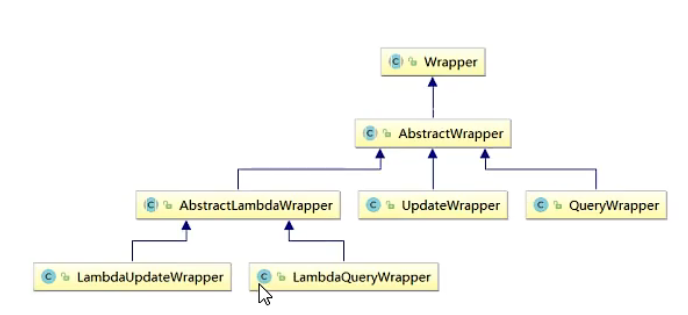
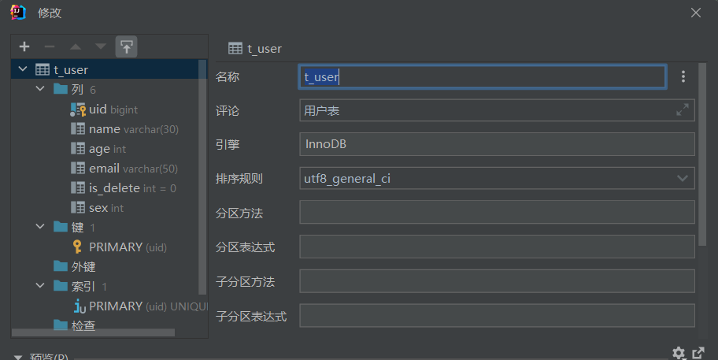

# Mybatis-Plus


## 创建Spring Boot项目

## 导入依赖

pom.xml文件

```xml
<dependency>
    <groupId>org.springframework.boot</groupId>
    <artifactId>spring-boot-starter-web</artifactId>
</dependency>
<dependency>
    <groupId>com.baomidou</groupId>
    <artifactId>mybatis-plus-boot-starter</artifactId>
    <version>3.4.2</version>
</dependency>
<dependency>
    <groupId>com.mysql</groupId>
    <artifactId>mysql-connector-j</artifactId>
    <scope>runtime</scope>
</dependency>
<dependency>
    <groupId>org.projectlombok</groupId>
    <artifactId>lombok</artifactId>
    <optional>true</optional>
</dependency>
<dependency>
    <groupId>org.springframework.boot</groupId>
    <artifactId>spring-boot-starter-test</artifactId>
    <scope>test</scope>
</dependency>
```

## 修改配置文件

```yaml
spring:
  # 数据源信息
  datasource:
    # 配置数据源类型
    type: com.zaxxer.hikari.HikariDataSource
    # 配置连接数据库的各个信息
    driver-class-name: com.mysql.cj.jdbc.Driver
    url: jdbc:mysql://localhost:3306/mybatis_plus?characterEncoding=utf-8&userSSL=false
    username: root
    password: hsy031122

```

## 实体类

创建User类

```java
package xyz.kbws.pojo;

import lombok.AllArgsConstructor;
import lombok.Data;
import lombok.NoArgsConstructor;

/**
 * @author hsy
 * @date 2023/7/13
 */
@Data
@AllArgsConstructor
@NoArgsConstructor
public class User {
    private Long id;

    private String name;

    private Integer age;

    private String email;
}
```

## 创建UserMapper接口

UserMapper

```java
package xyz.kbws.mapper;

import com.baomidou.mybatisplus.core.mapper.BaseMapper;
import org.apache.ibatis.annotations.Mapper;
import xyz.kbws.pojo.User;

/**
 * @author hsy
 * @date 2023/7/13
 */
@Mapper
public interface UserMapper extends BaseMapper<User> {
}
```

### 查询

创建测试类MybatisPlusTest

```java
package xyz.kbws.mybatisplus;

import org.junit.jupiter.api.Test;
import org.springframework.beans.factory.annotation.Autowired;
import org.springframework.boot.test.context.SpringBootTest;
import xyz.kbws.mapper.UserMapper;
import xyz.kbws.pojo.User;

import java.util.List;

/**
 * @author hsy
 * @date 2023/7/13
 */
@SpringBootTest
public class MybatisPlusTest {
    @Autowired
    UserMapper userMapper;

    @Test
    public void testSelectList(){
        //通过条件构造器查询一个List集合，若没有条件，可以设置null作为参数
        List<User> users = userMapper.selectList(null);
        users.forEach(System.out::println);
    }
}
```

### 插入

```java
@Test
public void testInsert(){
    User user = new User();
    user.setId(6L);
    user.setName("hsy");
    user.setAge(21);
    user.setEmail("hsy040506@163.com");
    userMapper.insert(user);
}
```

### 删除

```java
@Test
public void testDelete(){
    userMapper.deleteById(6L);
}
```


## 开启日志

```yaml
mybatis-plus:
  configuration:
    log-impl: org.apache.ibatis.logging.stdout.StdOutImpl
```

## 创建Service接口

```java
package xyz.kbws.service;

import com.baomidou.mybatisplus.extension.service.IService;
import xyz.kbws.pojo.User;

/**
 * @author hsy
 * @date 2023/7/13
 */
public interface UserService extends IService<User> {
}
```

## 实现Service接口

```java
package xyz.kbws.service.impl;

import com.baomidou.mybatisplus.extension.service.impl.ServiceImpl;
import org.springframework.stereotype.Service;
import xyz.kbws.mapper.UserMapper;
import xyz.kbws.pojo.User;
import xyz.kbws.service.UserService;

/**
 * @author hsy
 * @date 2023/7/13
 */
@Service
public class UserServiceImpl extends ServiceImpl<UserMapper, User> implements UserService {
}

```

### 查询数量

```java
@Test
public void testGetCount(){
    int count = userService.count();
    System.out.println(count);
}
```

### 批量插入

```java
@Test
public void testInsertBatch(){
    List<User> list = new ArrayList<>();
    for (int i = 0; i < 10; i++) {
        User user = new User();
        user.setName("ybc"+i);
        user.setAge(20+i);
        list.add(user);
    }
    boolean b = userService.saveBatch(list);
    System.out.println(b);
}
```

## 常用注解

### @Table-name

当实体类的名字为`user`，数据库中的表为`t_user`时

```java
package xyz.kbws.pojo;

import com.baomidou.mybatisplus.annotation.TableName;
import lombok.AllArgsConstructor;
import lombok.Data;
import lombok.NoArgsConstructor;

/**
 * @author hsy
 * @date 2023/7/13
 */
@Data
@AllArgsConstructor
@NoArgsConstructor
@TableName("t_user")//设置实体类所对应的表名
public class User {
    private Long id;

    private String name;

    private Integer age;

    private String email;
}
```

也可以使用全局配置

```yaml
mybatis-plus:
  configuration:
    log-impl: org.apache.ibatis.logging.stdout.StdOutImpl
  # mybatis-plus的全局配置
  global-config:
    db-config:
      # 设置实体类所对应表的前缀
      table-prefix: t_
```

### @TableId

Mybatis-Plus默认把id作为主键，如果实体类中没有id，则需要指定一个主键，否则会报错

```java
package xyz.kbws.pojo;

import com.baomidou.mybatisplus.annotation.TableId;
import com.baomidou.mybatisplus.annotation.TableName;
import lombok.AllArgsConstructor;
import lombok.Data;
import lombok.NoArgsConstructor;

/**
 * @author hsy
 * @date 2023/7/13
 */
@Data
@AllArgsConstructor
@NoArgsConstructor
@TableName("t_user")
public class User {
    @TableId    //讲属性所对应的字段指定为主键
    private Long uid;

    private String name;

    private Integer age;

    private String email;
}
```

value属性

```java
package xyz.kbws.pojo;

import com.baomidou.mybatisplus.annotation.TableId;
import com.baomidou.mybatisplus.annotation.TableName;
import lombok.AllArgsConstructor;
import lombok.Data;
import lombok.NoArgsConstructor;

/**
 * @author hsy
 * @date 2023/7/13
 */
@Data
@AllArgsConstructor
@NoArgsConstructor
@TableName("t_user")
public class User {

    //value属性用于指定主键的字段
    @TableId(value = "uid")
    private Long id;

    private String name;

    private Integer age;

    private String email;
}
```

type属性，用于指定主键的创建方式（默认为雪花算法）

```java
package xyz.kbws.pojo;

import com.baomidou.mybatisplus.annotation.IdType;
import com.baomidou.mybatisplus.annotation.TableId;
import com.baomidou.mybatisplus.annotation.TableName;
import lombok.AllArgsConstructor;
import lombok.Data;
import lombok.NoArgsConstructor;

/**
 * @author hsy
 * @date 2023/7/13
 */
@Data
@AllArgsConstructor
@NoArgsConstructor
@TableName("t_user")
public class User {

    //type属性用于设置主键创建方式
    //AUTO为自增
    @TableId(type = IdType.AUTO)
    private Long id;

    private String name;

    private Integer age;

    private String email;
}
```

> 注意：type设置为自增时，数据库的主键必须也设置为自增

### 全局设置主键生成策略

```yaml
mybatis-plus:
  configuration:
    log-impl: org.apache.ibatis.logging.stdout.StdOutImpl
  # mybatis-plus的全局配置
  global-config:
    db-config:
      # 设置实体类所对应表的前缀
      table-prefix: t_
      # 设置统一的主键生成策略
      id-type: auto
```

### @TableField

```java
package xyz.kbws.pojo;

import com.baomidou.mybatisplus.annotation.TableField;
import com.baomidou.mybatisplus.annotation.TableId;
import com.baomidou.mybatisplus.annotation.TableName;
import lombok.AllArgsConstructor;
import lombok.Data;
import lombok.NoArgsConstructor;

/**
 * @author hsy
 * @date 2023/7/13
 */
@Data
@AllArgsConstructor
@NoArgsConstructor
public class User {

    private Long id;

    //指定属性所对应的字段名
    @TableField("user_name")
    private String name;

    private Integer age;

    private String email;
}
```


### @TableLogic

用于逻辑删除

```java
package xyz.kbws.pojo;

import com.baomidou.mybatisplus.annotation.TableField;
import com.baomidou.mybatisplus.annotation.TableId;
import com.baomidou.mybatisplus.annotation.TableLogic;
import com.baomidou.mybatisplus.annotation.TableName;
import lombok.AllArgsConstructor;
import lombok.Data;
import lombok.NoArgsConstructor;

/**
 * @author hsy
 * @date 2023/7/13
 */
@Data
@AllArgsConstructor
@NoArgsConstructor
@TableName("t_user")
public class User {

    //value属性用于指定主键的字段
    @TableId(value = "uid")
    private Long id;

    private String name;

    private Integer age;

    private String email;

    @TableLogic
    private Integer isDelete;
}
```

## 条件构造器

 

### QueryWapper

#### 组装查询条件

```java
@Test
public void test1(){
    QueryWrapper<User> query = new QueryWrapper<>();
    //查询用户名包含a，年龄在20到30之间，邮箱信息不为null的用户信息
    query.like("name","a").between("age",20,30).isNotNull("email");
    List<User> list = userMapper.selectList(query);
    System.out.println(list);

}
```


#### 组装排序条件

```java
@Test
public void test2(){
    QueryWrapper<User> queryWrapper = new QueryWrapper<>();
    //查询用户信息，按照年龄的降序排序，若年龄相同，则按照uid升序排序
    queryWrapper.orderByDesc("age").orderByAsc("uid");
    List<User> list = userMapper.selectList(queryWrapper);
    list.forEach(System.out::println);
}
```


#### 组装删除条件

```java
@Test
public void test3(){
    QueryWrapper<User> queryWrapper = new QueryWrapper<>();
    //删除邮箱地址为null的用户
    queryWrapper.isNull("email");
    int delete = userMapper.delete(queryWrapper);
    System.out.println(delete);
}
```

> 此语句本质是一条删除语句，将数据的`id_delete`从0改成1

#### 实现修改功能

```java
@Test
public void test4(){
    QueryWrapper<User> queryWrapper = new QueryWrapper<>();
    //将（年龄大于20并且用户名中包含有a）或邮箱为null的用户信息修改
    queryWrapper.gt("age",20)
            .like("name","a")
            .or()
            .isNull("email");
    User user = new User();
    user.setName("hsy");
    user.setEmail("hsy@163.com");
    int update = userMapper.update(user, queryWrapper);
    System.out.println(update);
}
```


#### 条件的优先级

```java
@Test
public void test5(){
    QueryWrapper<User> queryWrapper = new QueryWrapper<>();
    //将用户名中含有a并且（年龄大于20或邮箱为null）的用户信息修改
    //lambda中的条件优先执行
    queryWrapper.like("name", "a")
            .and(i->i.gt("age",20).isNull("email"));
    User user = new User();
    user.setName("hsy");
    user.setEmail("hsy@163.com");
    int update = userMapper.update(user, queryWrapper);
    System.out.println(update);
}
```


#### 组装select字句

```java
@Test
public void test6(){
    //查询用户的用户名、年龄、邮箱信息
    QueryWrapper<User> queryWrapper = new QueryWrapper<>();
    queryWrapper.select("name","age","email");
    List<Map<String, Object>> maps = userMapper.selectMaps(queryWrapper);
    maps.forEach(System.out::println);
}
```


#### 实现子查询

```java
@Test
public void test7(){
    //查询uid小于100的用户信息
    QueryWrapper<User> queryWrapper = new QueryWrapper<>();
    queryWrapper.inSql("uid","select uid from t_user where uid <= 100");
    List<User> list = userMapper.selectList(queryWrapper);
    list.forEach(System.out::println);
}
```


### UpdateWapper

#### 修改功能

```java
@Test
public void test8(){
    //将用户名中包含有a并且（年龄大于20或邮箱为null）的用户信息修改
    UpdateWrapper<User> updateWrapper = new UpdateWrapper<>();
    updateWrapper.like("name","a")
            .and(i->i.gt("age",20).or().isNull("email"));
    updateWrapper.set("name","小黑").set("email","abc@test.com");
    int update = userMapper.update(null, updateWrapper);
    System.out.println(update);
}
```


### condition

```java
@Test
public void test9(){
    String username="";
    Integer ageBegin=null;
    Integer ageEnd=30;
    QueryWrapper<User> queryWrapper = new QueryWrapper<>();
    queryWrapper.like(StringUtils.isNotBlank(username),"name",username)
            .ge(ageBegin != null,"age",ageBegin)
            .le(ageEnd!=null,"age",ageEnd);
    List<User> list = userMapper.selectList(queryWrapper);
    list.forEach(System.out::println);
}
```


### LambdaQueryWapper

```java
@Test
public void test10(){
    String username="";
    Integer ageBegin=null;
    Integer ageEnd=30;
    LambdaQueryWrapper<User> queryWrapper = new LambdaQueryWrapper<>();
    queryWrapper.like(StringUtils.isNotBlank(username),User::getName,username)
            .ge(ageBegin!=null,User::getAge,ageBegin)
            .le(ageEnd!=null,User::getAge,ageEnd);
    List<User> list = userMapper.selectList(queryWrapper);
    list.forEach(System.out::println);
}
```


### LambdaUpdateWapper

```java
@Test
public void test11(){
    //将用户名中包含有a并且（年龄大于20或邮箱为null）的用户信息修改
    LambdaUpdateWrapper<User> updateWrapper = new LambdaUpdateWrapper<>();
    updateWrapper.like(User::getName,"a")
            .and(i->i.gt(User::getAge,20).or().isNull(User::getEmail));
    updateWrapper.set(User::getName,"小黑").set(User::getEmail,"abc@test.com");
    int update = userMapper.update(null, updateWrapper);
    System.out.println(update);
}
```


## 插件

### 分页插件

#### 添加配置类

```java
@Configuration
public class MybatisPlusConfig {
    @Bean
    public MybatisPlusInterceptor mybatisPlusInterceptor(){
        MybatisPlusInterceptor interceptor = new MybatisPlusInterceptor();
        interceptor.addInnerInterceptor(new PaginationInnerInterceptor(DbType.MYSQL));
        return interceptor;
    }
}
```


#### 测试

```java
@Autowired
UserMapper userMapper;

@Test
public void test1(){
    Page<User> page = new Page<>(1,3);
    Page<User> userPage = userMapper.selectPage(page, null);
    System.out.println(userPage.getRecords());
}
```


### XML自定义分页

#### UserMapper中定义接口方法

```java
/**
 * 通过年龄查询用户信息并分页
 * @param page  Mybatis-Plus提供的分页对象，必须位于第一个参数的位置
 * @param age   用户的年龄
 * @return
 */
Page<User> selectPageVo(@Param("page") Page<User> page,@Param("age") Integer age);
```


#### UserMapper.xml中编写SQL

```xml
<?xml version="1.0" encoding="utf-8" ?>
<!DOCTYPE mapper
        PUBLIC "-//mybatis.org//DTD Mapper 3.0/EN"
        "http://mybatis.org/dtd/mybatis-3-mapper.dtd">
<mapper namespace="xyz.kbws.mapper.UserMapper">
    <select id="selectPageVo" resultType="User">
        select uid,name,age,email from t_user where age > #{age}
    </select>
</mapper>
```

测试

```java
@Test
public void test2(){
    Page<User> page = new Page<>(1,2);
    Page<User> page1 = userMapper.selectPageVo(page, 20);
    System.out.println(page1.getRecords());
}
```

### 乐观锁

#### 场景


#### 乐观锁与悲观锁


#### 模拟修改冲突


##### 数据库中增加商品表

```sql
create table t_product(
    id bigint(20) not null comment '主键ID',
    name varchar(30) null default null comment '商品名称',
    price int(11) default 0 comment '商品价格',
    version int(11) default 0 comment '乐观锁版本号',
    primary key (id)
)comment '商品表';
```


##### 增加数据

```sql
insert into t_product (id, name, price) values (1,'外星人笔记本',100);
```


##### 增加实体

```java
package xyz.kbws.pojo;

import lombok.AllArgsConstructor;
import lombok.Data;
import lombok.NoArgsConstructor;

/**
 * @author hsy
 * @date 2023/7/15
 */
@Data
@AllArgsConstructor
@NoArgsConstructor
public class Product {
    private Long id;
    private String name;
    private Integer price;
    private Integer version;
}
```


##### 添加Mapper

```java
@Mapper
public interface ProductMapper extends BaseMapper<Product> {
}
```


##### 测试

```java
@Test
public void test3(){
    //小李查询商品价格
    Product productLi = productMapper.selectById(1);
    //小王查询商品价格
    Product productWang = productMapper.selectById(1);
    //小李将商品价格+50
    productLi.setPrice(productLi.getPrice()+50);
    productMapper.updateById(productLi);
    //小王将商品价格-30
    productWang.setPrice(productWang.getPrice()-30);
    productMapper.updateById(productWang);
    //老板查询商品价格
    Product productLaoBan = productMapper.selectById(1);
    System.out.println(productLaoBan);
}
```


#### 乐观锁实现流程

数据库中添加version字段

取出记录时获取当前version

```sql
select id,name,price,version from product where id=1;
```

更新时version+1，如果where语句中的version版本不对，则更新失败

```sql
update product set price=price+50, version=version+1 where id=1 and version=1
```


#### Mybatis—Plus实现乐观锁

##### 修改实体类

```java
@Data
@AllArgsConstructor
@NoArgsConstructor
public class Product {
    private Long id;
    private String name;
    private Integer price;
    @Version    //标识乐观锁版本号字段
    private Integer version;
}
```


##### 添加乐观锁插件配置

```java
@Configuration
public class MybatisPlusConfig {
    @Bean
    public MybatisPlusInterceptor mybatisPlusInterceptor(){
        MybatisPlusInterceptor interceptor = new MybatisPlusInterceptor();
        interceptor.addInnerInterceptor(new PaginationInnerInterceptor(DbType.MYSQL));
        //添加乐观锁插件
        interceptor.addInnerInterceptor(new OptimisticLockerInnerInterceptor());
        return interceptor;
    }
}
```


##### 测试修改流程


## 通用枚举

表中有些字段值是固定的，例如性别（男或女），此时我们可以用MyBaits-Plus的通用枚举实现

### 数据库添加字段sex




### 创建通用枚举类型

```java
@Getter
public enum SexEnum {
    MAN(1,"男"),
    WOMAN(2,"女");

    @EnumValue  //将注解所标识的值存储到数据库中
    private Integer sex;
    private String sexName;

    SexEnum(Integer sex, String sexName) {
        this.sex = sex;
        this.sexName = sexName;
    }
}
```


### 配置扫描通用枚举

```yaml
mybatis-plus:
  # 扫描通用枚举的包
  type-enums-package: xyz.kbws.enums
```


### 测试

```java
@Test
public void test4(){
    User user = new User();
    user.setName("admin");
    user.setAge(33);
    user.setSex(SexEnum.MAN);
    int insert = userMapper.insert(user);
    System.out.println(insert);
}
```


## 代码生成器

### 引入依赖

```xml
<dependency>
    <groupId>com.baomidou</groupId>
    <artifactId>mybatis-plus-generator</artifactId>
    <version>3.5.1</version>
</dependency>
<dependency>
    <groupId>org.freemarker</groupId>
    <artifactId>freemarker</artifactId>
    <version>2.3.31</version>
</dependency>
```


### 快速生成

```java
public class FastGeneratorTest {
    public static void main(String[] args) {
        FastAutoGenerator.create("jdbc:mysql://127.0.0.1:3306/mybatis_plus?characterEncoding=utf-8&userSSL=false",
                "root","hsy031122")
                .globalConfig(builder -> {
                    builder.author("hsy")   //设置作者
                            .enableSwagger()    //开启swagger模式
                            .fileOverride() //覆盖已生成文件
                            .outputDir("E://mybatis_plus"); //指定输出目录
                })
                .packageConfig(builder -> {
                    builder.parent("xyz.kbws")  //设置父包名
                            .moduleName("mybatisplus")  //设置父模块名
                          .pathInfo(Collections.singletonMap(OutputFile.mapperXml,"E://mybatisplus"));//设置MapperXml生成路径
                })
                .strategyConfig(builder -> {
                    builder.addInclude("t_user")    //设置需要生成的表名
                            .addTablePrefix("t_","c_"); //设置过滤表的前缀
                })
                .templateEngine(new FreemarkerTemplateEngine()) //使用Freemarker引擎模板，默认的是Velocity模板
                .execute();
    }
}
```

