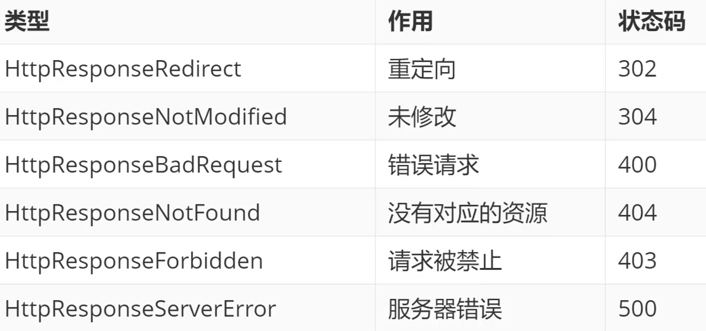
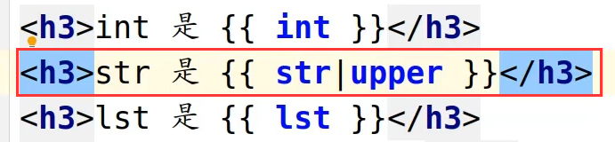

# 请求与响应

## HTTP协议的请求和响应

### 定义

请求是指浏览器端通过HTTP协议发送给服务器端的数据

响应是服务器端接收到请求后做响应的处理后再回复给浏览器端的数据


### 请求样例


### 请求中的方法

根据HTTP标准，HTTP请求可以使用多种请求方法

HTTP1.0定义了三种请求方法：GET、POST和HEAD方法（最常用）

HTTP1.1新增了五种请求方法：OPTIONS, PUT, DELETE, TRACE和CONNECT方法


## Django中的请求

- 请求在Django中实则就是视图函数的第一个，即HttpRequest对象
- Django在收到http协议的请求后，会根据请求数据报文创建HttpRequest对象
- HttpRequest对象通过属性描述了请求的所有相关信息


- path_info: URL字符串
- method:字符串，表示HTTP的请求方法，常用值：‘GET’、‘POST’
- GET: QueryDict查询字典的对象，包含get请求方式的所有数据
- POST: QueryDict查询字典的对象，包含post请求的所有数据
- FILES:类似于字典的对象，包含所有的上传文件信息


## 响应

### 响应样例


### 响应状态码

下面是常见的响应状态码：


HTTP状态码由三个十进制数字组成，第一个数字定义了状态码的类型，后两个数字没有分类的作用。HTTP状态码分为5种类型：


### Django中的响应对象

#### 构造函数格式

HttpReponse(content=响应体,content_type=响应体数据类型,status=状态码)

#### 作用

向客户端浏览器返回响应时，同时携带响应体内容

#### 参数


#### 常用的Content-Type


#### HttpResponse子类




---


# GET和POST

## 定义

无论是GET还是POST，统一都由视图函数接收请求，通过判断request.method来区分具体的请求动作

样例


## GET处理

GET请求动作，一般用于向服务器获取数据

能够产生GET请求的场景：

浏览器地址栏输入URL，回车后

`<a href = " 地址?参数=值&参数=值">`

form表单中method为get


GET请求方式中，如果有数据需要传递给服务器，通常会用查询字符串(Query String)传递。

注意：不要传递敏感数据


## 方法示例


当传递有相同参数名但多个的值的时候，使用`request.GET.getlist`

## 向前端传递参数


将查询到的数据封装，然后通过Django的json对象传递给参数

### JsonResponse

```python
- 主要用于前后端交互发送数据
	
    - 使用json模块来返回json格式的数据
        def test_json(request):
            import json
            user_dict = {'user': '王', 'password': 123456}
            # ensure_ascii=True会将中文转换为编码 {"user": "\u738b", "password": 123456}
            json_str = json.dumps(user_dict, ensure_ascii=False)
            return HttpResponse(json_str)
    - 使用Django的JsonResponse对象实现
        def test_json(request):
            from django.http import JsonResponse
            user_dict = {'user': '王', 'password': 123456}
            # JsonResponse 的传值方式 将json.dumps()中的参数用字典方式传送
            return JsonResponse(user_dict, json_dumps_params={'ensure_ascii': False})
    - 将非字典格式的序列通过JsonResponse对象传值
        def test_json(request):
            from django.http import JsonResponse
            ls = [i for i in range(10)]
            # JsonResponse 的传值方式 将json.dumps()中的参数用字典方式传送
            # 非字典序列必须设置参数 safe=False
            return JsonResponse(ls, json_dumps_params={'ensure_ascii': False}, safe=False)
```


## POST处理

POST请求动作，一般用于向服务器提交大量/隐私数据

客户端通过表单等POST请求将数据传递给服务器端，如：


服务器端接收参数

通过request.method来判断是否为POST请求，如：


使用POST方式接收客户端数据


==注意：==要取消csrf验证，否则Django会拒绝客户端发送过来的POST请求，报403响应

### 取消csrf验证

禁止掉settings.py中MIDDLWARE中的CsrfViewMiddleWare的中间件


---


# 设计模式及模板层

## MVC和MTV

### MVC

MVC代表Model-View-Controller（模型-视图-控制器）模式

- M 模型层（Model）主要用于对数据库层的封装
- V 视图层（View）用于向用户展示结果（WHAT+HOW）
- C 控制层（Controller），用于处理请求、获取数据、返回结果（重要）

作用：降低模块之间的耦合度（解耦）


### MTV

MTV代表Model-Template-View（模型-模板-视图）模式

- M 模型层（Model）负责与数据库交互
- T 模板层（Template）负责呈现内容到浏览器（HOW）
- V 视图层（View）是核心，负责接收请求、获取数据、返回结果（WHAT）

作用：降低模块之间的耦合度（解耦）


## 模板层

### 什么是模板

模板是可以根据字典数据动态变化的HTML网页

模板可以根据视图中传递的字典数据动态生成相应的HTML网页

### 模板配置

创建模板文件夹<项目名>/templates

在settings.py中TEMPLATES配置项

1. BACKEND：指定模板的引擎
2. DIRS：模板的搜索目录（可以是一个或多个）
3. APP_DIRS：是否要在应用中的templates文件夹中搜索模板文件
4. OPTIONS有关模板的选项

#### 配置项中需要修改的部分

设置`DIRS - 'DIRS':[os.path.join(BASE_DIR,'templates')],`


注意：template文件夹要与项目同名的文件夹同级


### 模板的加载方式

#### 方式一

通过loader获取模板，通过HttpResponse进行响应

在视图函数中


views：

```python
def test_html(request):
    from django.template import loader
    t = loader.get_template('test_html.html')
    html = t.render()
    return HttpResponse(html)
```

urls：

```python
path('test_html',views.test_html)
```

#### 方式二

使用render( )直接加载并响应模板

在视图函数中


### 视图层与模板层之间的交互

#### 第一种

视图函数可以将Python变量封装到==字典==中传递到模板

样例：

```python
def xxx_view(request):
    dic = {
        "变量1":"值1",
        "变量2":"值2",
    }
    return render(request,'xxx.html',dic)
```

#### 第二种

模板中，我们可以用`{{变量名}}`的语法调用视图传进来的变量


---


# 变量与标签

## 模板层-变量


### 能传递到模板中数据类型


### 在模板中使用变量语法

```python
{{ 变量名 }}
{{ 变量名.index }}//变量为容器时
{{ 变量名.key }}//变量为字典时
{{ 对象.方法 }}
{{ 函数名}}
```


## 模板层-标签

### 作用

将一些服务器端的功能嵌入到模板中，例如流程控制等

### 语法

```python

. . .

```

### if标签

#### 语法

```python

. . .

. . .

. . .

. . .

```

#### 注意

1. if条件表达式里可以用的运算符 ==，!=，<，>，<=，>=，in，not in，is，is not，not，and，or
2. 在if标记中使用实际括号是无效的语法。如果需要它们指示优先级，则应使用嵌套的if标记


python中有一个local方法，可以把上一次提交的数据返回回去，相当于返回上面的dic


记录此时的状态

### for标签

#### 语法

```python

. . . 循环语句

. . . 可迭代对象无数据时填充的语句

```

#### 内置变量


---


# 过滤器和继承

## 过滤器

### 定义

在变量输出时对变量的值进行处理

### 作用

可以通过过滤器来改变变量的输出显示

### 语法

```python
{{ 变量|过滤器1:'参数值1'|过滤器2:'参数值2'... }}
```

### 常用过滤器


### 例子



## 继承

模板继承可以使父模板的内容重用，子模板直接继承父模板的全部内容并可以覆盖父模板中相应的块

### 语法

#### 父模板

定义父模板中的块block标签

标识出哪些在子模块中是允许被修改的

block标签：在父模板中定义，可以在子模板中覆盖

#### 子模板

继承模板extends标签（写在模板文件第一行）

例如：``

子模块重写父模板中的内容块

```python

子模板块用来覆盖父模板中 block_name 块的内容

```

### 重写的覆盖规则

不重写，按照父模板的效果展示

重写，按照重写效果展示

### 注意

模板继承时，服务器端的动态内容无法继承


---


# URL反向解析

## 再谈url

### 代码中出现url的位置

#### 模板html中

```html
<a href='url'>超链接</a>
	点击后，页面跳转到url
<form action='url' method='post'>
    form表单中的数据用post方法提交至url
```

#### 视图函数中

302跳转

```python
HttpReponseRedirect('url')
将用户地址栏中的地址跳转到url
```

### 代码中url书写规范

#### 绝对地址

`http://127.0.0.1:8000/page/1`

#### 相对地址

'/page/1' - '/ ' 开头的相对地址，浏览器会把当前地址栏里的协议，ip和端口加上这个地址，作为最终访问的地址，即如果当前页面地址栏为`http://127.0.0.1:8000/page/3`当前相对地址最终结果为`http://127.0.0.1:8000 + /page/1`


'/page/1' - 没有'/ ' 开头的相对地址，浏览器会根据当前url的最后一个`/`之前的内容加上该相对地址作为最终的访问地址，例如当前地址栏地址为`http://127.0.0.1:8000/topic/detail`

则该相对地址最终结果为`http://127.0.0.1:8000/topic + page/1`

## url反向解析

url反向解析是指在函数或模板中，用path定义的名称来==动态查找或计算出相应的路由==

### path函数语法

`path(route,views,name="别名")`

`path('page',views.page_view,name="page_url")`

根据path中的`name=`关键字传参给url确定了个唯一确定的名字，在模板或视图中，可以通过这个名字反向推断出此url信息

模板中 - 通过url标签实现地址的反向解析

```python


例如：


```

### 例子

#### urls.py


#### test_url.html


### 视图函数中

可调用Django中的reverse方法进行反向解析

```python
from django.urls import reverse
reverse('别名', arg=[], kwargs={})
例子：
print(reverse('page', arg=[300]))
print(reverse('page', kwargs={'name':'xixi','age':18}))
```

