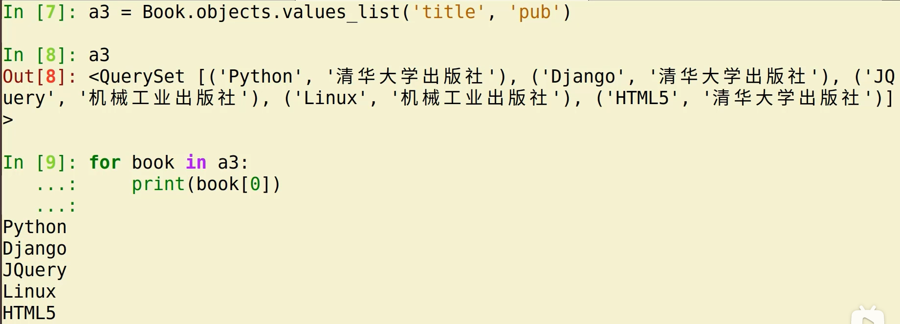

# ·查询操作

## 查询简介

数据库的查询需要使用管理器对象进行

通过MyModel.objects管理器方法调用查询方法

| 方法      | 说明                         |
| --------- | ---------------------------- |
| all()     | 查询所有记录返回QuerySet对象 |
| get()     | 查询符合条件的单一记录       |
| filter()  | 查询符合条件的多条记录       |
| exclude() | 查询符合条件之外的全部记录   |

## 查询方法

### all()方法

用法：`MyModel.object.all()`

作用：查询MyModel实体中的所有数据

等同于`select * from table`

返回值：QuerySet容器对象，内部存放MyModel实例

```python
from bookstore.models import Book
books = Book.objects.all()
for book in books:
    print("书名",book.title,'出版社：',book.pub)
```


### values('列1','列2'...)

用法：`MyModel.objects.values(...)`

作用：查询部分列的数据并返回等同于`select 列1,列2 from xxx`

返回值：QuerySet，返回查询结果容器，容器内存字典，每个字典代表一条数据，格式为`{'列1':值1,'列2':值2}`

### values_list('列1','列2'...)

用法：`MyModel.objects.values_list(...)`

作用：返回元组形式的查询结果，等同于`select 列1，列2from xxx`

返回值：返回QueerySet容器对象，内部存放元组

会将查询出来的数据封装到元组中，在封装到查询集合QuerySet中



### order_by()

用法：`MyModel.objects.order_by('-列','列')`

作用：与all()方法不同，它会用SQL语句的ORDER BY子句对查询结果进行根据某个字段选择性的进行排序

说明：默认是按照升序排序，降序排序需要在列前增加 ' - ' 表示

### filter(条件)

语法：`MyMOdel.objects.filter(属性1=值1,属性2=值2)`

作用：返回包含此条件的全部数据集

返回值：QuerySet容器对象，内部存放MyModel实例

说明：当多个属性在一起时为与关系

例子


### exclude(条件)

语法：`MyMOdel.objects.exclude(条件)`

作用：返回不包含此条件的全部数据集

例子：


### get(条件)

语法：`MyModel.objects.get(条件)`

作用：返回满足条件的唯一一条数据

说明：该方法只能返回一条数据，查询结果多余一条数据则抛出`Model.MultipleObjectsReturned`异常

​			查询结果如果没有数据则抛出`Model.DoesNotExist`异常

## 查询谓词

定义：做更灵活的条件查询时需要使用查询谓词

说明：每一个查询谓词都是一个独立的查询功能

### _exact

等值匹配

```python
Author.objects.filter(id_exact=1)
# 等同于select * from author where id = 1
```

### _contains

包含指定值

```python
Author.object.filter(name_contains='w')
# 等同于select * from author where name like '%w%'
```

### _startswith

以XXX开始

### _endswith

以XXX结束

### _gt

包含指定值

```python
Author.object.filter(age_gt=50)
# 等同于 select * from author where age>50
```

### _gte

大于等于

### _lt

小于

### _lte

小于等于

### _in

查找数据是否在指定范围内

```python
Author.object.filter(country_in=['中国','日本','韩国'])
# 等同于 select * from author where country in ('中国','日本','韩国')
```

### _range

查找数据是否在指定的区间范围内

```python
# 查找年龄在某一区间内的所有读者
Author.object.filter(age_range(35,50))
# 等同于select * from author where Author between 35 and 50
```

# 更新操作

## 修改单个实体的某些字段值

1. 查

    通过get()得到要修改的实体对象

2. 改

    通过 对象 . 属性的方式修改数据

3. 保存

    通过 对象 . save()保存数据

## 批量更新数据


# 删除操作

## 单个数据删除

1. 查找查询结果对应的一个数据对象
2. 调用这个数据对象的delete()方法实现删除

```python
try:
    auth = Author.objects.get(id=1)
    auth.delete()
except:
    print("删除")
```

