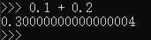

# 基础数据类型

### **整数**

整数和我们生活中定义的整数是一个概念，例如：`1`,`2`,`3`,`10`,`100`,`1000`,`-1000` 等等，都是整数，Python可以处理任意大小的整数。

对于整数，除了生活中常用的十进制以外，计算机由于使用二进制，所以，在计算机中也常用二进制或者十六进制表示整数。相比十进制数，在Python中使用以下方式表示二进制数和十六进制数。

二进制数只使用数字0、1表示，在Python中，二进制整数使用前缀`0b`表示，比如：`0b0110`，`0b1100`。

十六进制数除了0~9十个数字以外，还使用a、b、c、d、e、f，在Python中，十六进制使用前缀`0x`，比如：`0x12ef`，`0xde2431af`。

对于很大的数，例如`10000000000`，很难数清楚0的个数。Python==允许在数字中间以`_`分隔==，因此，写成`10_000_000_000`和`10000000000`是完全一样的。十六进制数也可以写成`0xa1b2_c3d4`。 

### **浮点数**

浮点数对应我们生活的是小数，例如：`0.1`,`0.5`, `12.34`, `3.1415926`等，都是浮点数。

为什么小数在计算机领域被称为浮点数呢？这是因为按照科学记数法表示时，一个浮点数的小数点位置是可变的（浮动的），比如，`1.23x10^9`和`12.3x10^8`是相等的，因此称为浮点数。

#### 数学写法

浮点数可以用数学写法，如`1.23`，`3.14`，`-9.01`。但是对于很大或很小的浮点数，就必须用科学计数法表示，在Python中，==把10用e替代==，比如：`1.23x10^9`就是`1.23e9`，或者`12.3e8`，`0.000012`可以写成`1.2e-5`，同学可以自行举出更多的例子。

这里有必要提醒一点就是，整数和浮点数在计算机内部存储的方式是不同的，整数运算永远是精确的，而浮点数运算则可能会有四舍五入的误差，如何检验，可以在Python终端中输入以下内容`0.1 + 0.2`，看看可以得到你期望的结果`0.3`吗？真实结果可能让你失望了。


同样的，这里涉及的原理同学也可以学习上面提到的课程进行进一步原理层面的理解。

### **字符串**

字符串对应生活中的就是非数字类型的内容，比如一个句子，一段话，在Python中就是字符串，在Python中，字符串是以单引号`'`或双引号`"`括起来的任意文本，比如'abc'，"xyz"等等。请注意，''或""本身只是一种表示方式，不是字符串的一部分，因此，字符串'abc'只有a，b，c这3个字符。如果`'`本身也是一个字符，那就可以用`""`括起来，比如`"I'm OK"`包含的字符是`I`，`'`，`m`，空格，`O`，`K`这6个字符。 

比如之前练习过的第一个Python程序：`print('Hello World')`，其中的`Hello World`就是字符串。

#### 转义字符

如果字符串内部既包含`'`又包含`"`怎么办？可以用转义字符`\`来标识，比如：

```python
'I\'m \"OK\"!'
```

表示的字符串内容是：

```python
I'm "OK"!
```

转义字符`\`可以转义很多字符，比如`\n`表示换行，`\t`表示制表符，字符`\`本身也要转义，所以`\\`表示的字符就是`\`

#### 不转义

如果字符串里面有很多字符都需要转义，就需要加很多`\`，为了简化，Python还允许用`r''`表示`''`内部的字符串默认不转义：

```python
print('\\\t\\')
\       \
print(r'\\\t\\')
\\\t\\
```

#### 多次换行

如果字符串内部有很多换行，用`\n`写在一行里不好阅读，为了简化，Python允许用`'''...'''`的格式表示多行内容：

```python
print('''line1
... line2
... line3''')
line1
line2
line3
```


### **布尔值**

布尔值对应于生活中的就是`对`和`错`，在计算机的世界里，大部分判断都是非错则对的，布尔值和布尔代数的表示完全一致，一个布尔值只有True、False两种值，要么是True，要么是False，在Python中，可以直接用True、False表示布尔值（请注意大小写，不需要使用字符串符号括起来），也可以通过布尔运算计算出来。

布尔值可以用`and`、`or`和`not`运算（注意`and`,`or`,`not`都是Python语言本身的关键字）。

`and`运算是与运算，只有所有都为 True，and运算结果才是 True。

`or`运算是或运算，只要其中有一个为 True，or 运算结果就是 True。

`not`运算是非运算，它是一个单目运算符，把 True 变成 False，False 变成 True。

布尔值经常用在条件判断中，比如：

```python
if age >= 18:
    print('adult')
else:
    print('teenager')
```

需要注意的是，not计算的优先级是高于and和or的。

```python
True and not False # ==> True
```

在上述布尔计算中，先计算`not False = True`，然后再计算`True and True`，因此得到True的结果。

#### **短路计算**

1. 在计算`a and b`时，如果 a 是 False，则根据与运算法则，整个结果必定为 False，因此返回 a；如果 a 是 True，则整个计算结果必定取决与 b，因此返回 b。
2. 在计算`a or b`时，如果 a 是 True，则根据或运算法则，整个计算结果必定为 True，因此返回 a；如果 a 是 False，则整个计算结果必定取决于 b，因此返回 b。

所以Python解释器在做布尔运算时，只要能提前确定计算结果，它就不会往后算了，直接返回结果。

### **空值**

空值是Python里一个特殊的值，用`None`表示。

注意，None和0是不一样的，None不能理解为0，因为0是有意义的，比如我有0个苹果表示我没有苹果，0表达的是数值0的意思，而不能表示为我有None个苹果，None是一个特殊的空值。