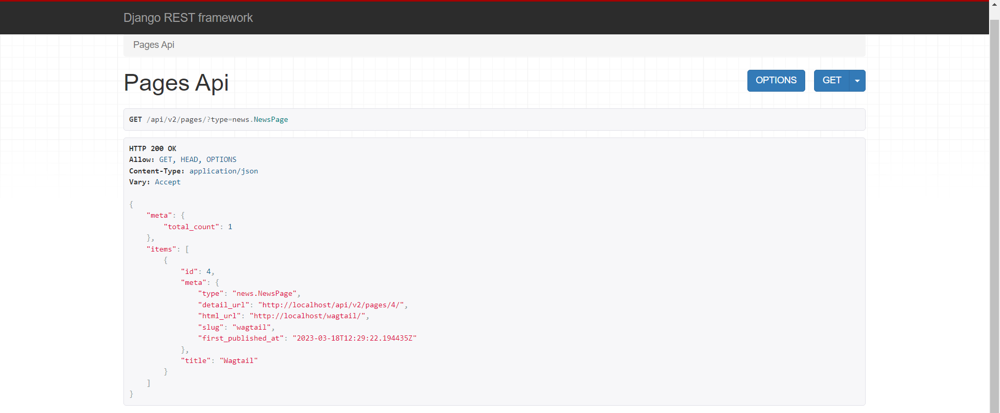
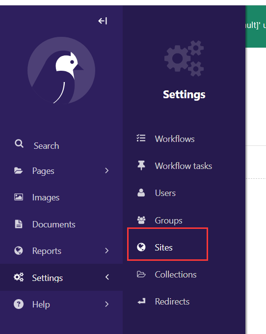

# 环境配置

pip换源

国内pip下载速度较慢，需要换源

在`C:\User\xxx`目录中创建名为pip的文件夹


然后在里面创建`pip.ini`文件，在文件中添加以下内容

```ini
[global]
index-url=https://pypi.tuna.tsinghua.edu.cn/simple
timeout = 6000
[install]
trusted-host=pypi.tuna.tsinghua.edu.cn
disable-pip-version-check = true
```

Python虚拟环境管理工具

安装：`pip install pipenv`

初始化虚拟环境：`pipenv install`

进入虚拟环境：`pipenv shell`

退出：`exit()`

创建Wagtail项目

```
wagtail start backend
```


下载相关依赖

进入项目文件夹

```
cd backend
```

下载相关依赖

```
pip install -r requirements.txt
```

查看软件版本

```
python -V
pip show wagtail
pip show Django
```

迁移数据库

```
python manage.py migrate
```

创建超级用户

```
python manage.py createsuperuser
```

运行项目

```
python manage.py runserver
```

创建应用

```
python manage.py startapp 
```

导入app，在base.py文件中，添加

```
INSTALLED_APPS = [
	"news",
]
```

# API

通过API来访问页面，用来测试接口

在base.py文件中，添加

```
INSTALLED_APPS = [
	'wagtail.api.v2',
	"rest_framework",
]
```

项目同名文件夹下创建api.py文件


在文件中写入

```python
# api.py

from wagtail.api.v2.views import PagesAPIViewSet
from wagtail.api.v2.router import WagtailAPIRouter
from wagtail.images.api.v2.views import ImagesAPIViewSet
from wagtail.documents.api.v2.views import DocumentsAPIViewSet

# Create the router. "wagtailapi" is the URL namespace
api_router = WagtailAPIRouter('wagtailapi')

# Add the three endpoints using the "register_endpoint" method.
# The first parameter is the name of the endpoint (such as pages, images). This
# is used in the URL of the endpoint
# The second parameter is the endpoint class that handles the requests
api_router.register_endpoint('pages', PagesAPIViewSet)
api_router.register_endpoint('images', ImagesAPIViewSet)
api_router.register_endpoint('documents', DocumentsAPIViewSet)
```

urls.py中写入

```python
from .api import api_router

urlpatterns = [
    path('api/v2/', api_router.urls),
]
```

访问URL：http://localhost:8000/api/v2/pages/ 可以看到两个页面的信息

访问自己写的页面：http://localhost:8000/api/v2/pages/?type=news.NewsPage



访问页面内容

model.py引入

```python
from wagtail.api import APIField

class NewsPage(Page):
    intro = models.CharField(max_length=250)
    body = RichTextField(blank=True)

    content_panels = Page.content_panels + [
        FieldPanel('intro'),
        FieldPanel('body'),
    ]

    api_fields = [
        APIField('intro'),
        APIField('body'),
    ]
```

访问URL：http://localhost:8000/api/v2/pages/?type=news.NewsPage&fields=intro,body


修改运行端口



修改为默认8000端口


# 解决跨域问题

下载`django-cors-headers`

```
pip install django-cors-headers
```

在base.py 中添加

```python
INSTALLED_APPS = [
    "corsheaders",
]
```

添加`middleware`类来监听

```python
MIDDLEWARE = [
    "corsheaders.middleware.CorsMiddleware",
    "django.middleware.common.CommonMiddleware",
]
```

在文件尾部添加下面代码表示允许跨域

```python
CORS_ORIGIN_ALLOW_ALL = True
```

> CORS_ORIGIN_WHITELIST表示允许跨域的路径列表（可以不写）
>
> 例如：
>
> CORS_ORIGIN_WHITELIST = [
>
>   "https://example.com",
>
>   "https://sub.example.com",
>
> ]

# 获取子页面


发送axios请求后能获取页面的详细内容


页面标题和文章标题显示正常，但是文章内容的富文本显示的是原始的HTML代码

解决方法：

将原本的内容填充代码

```html
<p>{{item.body}}</p>
```

修改为

```html
<p v-html="item.body"></p>
```


至此，页面显示正常

