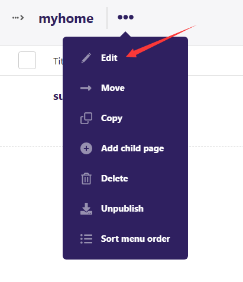
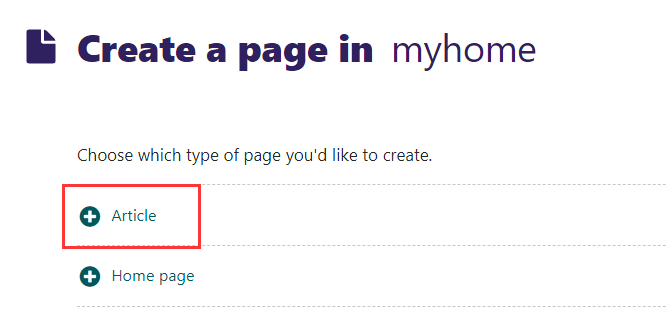

# 创建项目

1. 打开Pycharm新建Python项目


2. 打开终端执行下载命令`pip install wagtail`

3. 创建工程项目

    `wagtail start 项目名称`

    例：`wagtail start mysite`

    

    项目创建成功

4. 迁移数据库

    - 进入`manage.py`文件所在目录
    - 执行`python manage.py migrate`

5. 迁移成功后运行测试

    `python manage.py runserver`

    

    点击链接后

    

    显示如上页面则表示创建成功

# 账号和后台

1. 在终端终止当前进程

    `Ctrl+C`

2. 创建管理员账号

    终端输入`python manage.py createsuperuser`

    之后一次输入用户名、邮箱、密码

3. 登录后台

    - 在终端输入`python manage.py runserver`启动项目
    - 访问`http://127.0.0.1:8000/admin`
    - 输入用户名和密码

    

    登录成功

在后台可以对网页进行修改、删除、增加

选择要修改的页面


点击Edit进行修改



修改标题


修改完后点击Publish进行更新


此时我们访问项目首页`http://127.0.0.1:8000`发现网页标题已经发生变化


# 模板templates


添加页面步骤

1. 在models文件中添加类

    

2. 迁移数据库

    ```python
    python manage.py makemigrations
    python manage.py migrate
    ```

    将发生的变化在数据库中实现

3. 运行测试

    `python manage.py runserver`启动项目

    再次打开管理后台

    

    点击创建新页面

    

    此时可以看到新的类了

    

    输入网页标题并点击发布

    我们访问之后会报错

    

    这是正常的因为我们没用在模板中配置相关的页面

4. 在model的同级目录templates中的home目录下创建文件

    

    注意文件名字小写并且与model文件中类的名字一致

    在`article.html`文件中写入

    ```html
    <!DOCTYPE html>
    <html lang="en">
    <head>
        <meta charset="UTF-8">
        <title>Title</title>
    </head>
    <body>
        this is my article.
    </body>
    </html>
    ```

    现在刷新页面

    

    页面就不会报错了

# 数据模型models和Page类

后端对数据的处理大多都是在model层中进行

在HomePage中添加字段`subtitle = model.CharFiled(max_length=200,blank=True,null=True)`

CharFiled代表文字类型，max_length表示最大长度，blank表示是否可以为空，null表示是否可以设为null值

写完后进行数据迁移`python manage.py makemigrations/migrate`

之后对后端也就是显示面板进行处理，先在models中导入需要用到的模块

```python
from wagtail.admin.edit_handlers import FieldPanel
```

之后在HomePage类中添加

```python
content_panels = Page.content_panels + [
	FieldPanel('subtitle')
]
# 将原来的显示面板和现在要添加的内容拼接在一起
# FieldPanel('subtitle')字段面板
```


后端面板已经配置好了

在Subtitle中输入`this is a subtitle.`

现在访问主页是没用变化的

接下来在home_page.html文件中把原来的内容全部删掉

写入`{{ page.subtitle }}`

wagtail会把类的变量封装在page里面，使用标签语言`{{ }}`来获取参数


现在页面就能显示文字了


# 文本字段TextField和富文本字段RichtextField

在HomePage类中添加文本字段和富文本字段

`content = models.TextField(blank=True, null=True)`

迁移数据库后重启项目

再次打开管理员面板发现增加了Content1字段


再在home_page中获取变量


主页显示为


同理添加富文本

```python
from wagtail.core.fields import RichTextField #记得导入富文本模块
class HomePage(Page):
    content2 = RichTextField(blank=True, null=True)
    content_panels = Page.content_panels + [
        FieldPanel('content2')
    ]
```

在管理后端中可以添加富文本：二级标题、文本、图片等


要在页面显示则需要添加以下代码

```python

# 上面是导入所需要的模块
<p>{{ page.content2 | richtext }}</p>
# richtext是一个过滤器,是wagtail对需要渲染内容的重新格式化
```

显示结果如下


# 使用图片和文件

在models中添加代码

```python
image = models.ForeignKey(
    'wagtailimages.Image',
    blank=True,
    null=True,
    on_delete=models.DO_NOTHING
)
# 图片是以外键的形式添加，所以调用models的外键
# 处理图片需要导入wagtailimages.Image包	
# on_delete是指当包含图片的页面被删除时对图片的操作，DO_NOTHING指没用操作，CASCADE指同页面一起被删除，注意DO_NOTHING后面不要有括号
```

添加完后进行数据库迁移，重启项目


前端获取图片

```python

# 导入相关模块

# 调用专用的语法,图片必须指定尺寸，可以单独指定width和height或者指定全尺寸
```


网页中添加文件

在models中添加代码

```python
class HomePage(Page):
    file = models.FileField(
        blank=True,
        null=True
    )
    content_panels = Page.content_panels + [
        FieldPanel('file')
    ]
```

后端面板


前端添加如下代码

```python
<a href="{{ page.file.url }}">{{ page.file }}</a>
```

前端页面


点击链接可以下载


# HTML、CSS简介和引用bootstrap

HTML、CSS简介

略

引用bootstrap

打开https://v4.bootcss.com

将下面的代码复制到< head >标签中


之后就可以引入bootstrap的组件库了

出错


引入地址被锁定

解决方法：

打开https://www.bootcdn.cn/


# 可调序的Orderable类

把home_page中除了body中的内容全部转移到base.html中

base.html

```html

//注意导入模块
<!DOCTYPE html>
<html lang="en">
<head>
    <title></title>
</head>
<body>
//块标签，content是自己起的名字，其他继承了此文件的页面可以在block标签中书写自己的内容


</body>
</html>
```

home_base.html

```html
//继承标签要写在第一行


//写入本页面独有的内容


<div id="'div1">
    <div class="alert alert-primary" role="alert">
        A simple primary alert—check it out!
    </div>
    {{ page.subtitle }}
    <p>{{page.title}}</p>

    <p>{{ page.content1 }}</p>

    <p>{{ page.content2 | richtext }}</p>

    

    <a href="{{ page.file.url }}">{{ page.file }}</a>
</div>


```

Orderable适合写两种内容：轮播图，外链，卡片

model

```python
from django.db import models
from modelcluster.fields import ParentalKey
from wagtail.admin.edit_handlers import FieldPanel
from wagtail.admin.panels import InlinePanel
from wagtail.core.fields import RichTextField
from wagtail.models import Page, Orderable


class HomePage(Page):
    subtitle = models.CharField(max_length=200, blank=True, null=True)
    content1 = models.TextField(blank=True, null=True)
    content2 = RichTextField(blank=True, null=True)
    image = models.ForeignKey(
        'wagtailimages.Image',
        blank=True,
        null=True,
        on_delete=models.DO_NOTHING
    )
    file = models.FileField(
        blank=True,
        null=True
    )
    content_panels = Page.content_panels + [
        FieldPanel('subtitle'),
        FieldPanel('content1'),
        FieldPanel('content2'),
        FieldPanel('image'),
        FieldPanel('file'),
        InlinePanel('mycarousel', label='Carousel')//将一组数据添加到后端面板
    ]


class carousel(Orderable):
    page = ParentalKey(
        HomePage,  # 依附于哪个页面
        on_delete=models.CASCADE,
        related_name='mycarousel'  # HomePage想知道自己下面有几个Orderable的时候，需要一个查询的名字
    )
    image = models.ForeignKey(
        'wagtailimages.Image',
        blank=True,
        null=True,
        on_delete=models.DO_NOTHING
    )
    title = models.CharField(max_length=200, blank=True, null=True)
```

在管理员面板添加图片


home_base.html

```html






{{ page.mycarousel.all }}


<div>
    <h2>{{ item.title }}</h2>
    
</div>



```

网页显示


# 内容流字段StreamFiled和块字段Block

新建一个app

`django-admin startapp app名字`

在配置文件中注册


在article目录下的models文件书写

```python
from django.db import models
from wagtail.admin.panels import FieldPanel, StreamFieldPanel
from wagtail.core.models import Page
from wagtail.core.fields import StreamField
from wagtail.core import blocks
from wagtail.images.blocks import ImageChooserBlock


# Create your models here.


class Article(Page):
    intro = models.TextField(blank=True, null=True)
    content = StreamField(
        [
            ('subtitle', blocks.TextBlock()),  # 副标题
            ('paragraph', blocks.TextBlock()),
            ('image', ImageChooserBlock())
        ]
    )

    content_panels = Page.content_panels + [
        FieldPanel('intro'),
        StreamFieldPanel('content')
    ]
```

进行数据迁移

此时在后端面板可以在创建一个新的页面中有Article


新建页面


创建完成后还无法查看数据

在article目录下创建templates目录，在templates目录下创建与app同名的article目录，在article目录下创建同名html文件


article.html

```html
 


{{ page.title }}
{{ page.intro }}




    {{ item }}



    {{ item }}



    





```

网页展示


# 页面路由和路径

页面获得其子页面

在主页面home_page.html页面

```html

     //获取页面的所有子页面
    	<a href="{{ i.url }}">{{ i }}</a> //将子页面转成可以跳转的链接
    

```

获取父页面的链接

```html

```

