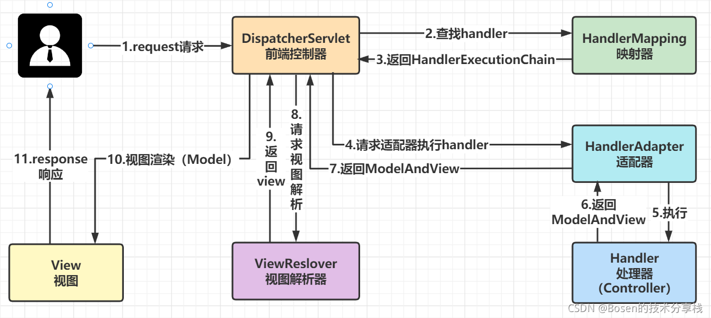

# Spring MVC理论

## Spring MVC处理流程



Spring MVC 处理流程如下：

1. 用户发送`request`请求到前端控制器`DispatcherServlet`。
2. 前端控制器`DispatcherServlet`通过`request`请求的url地址，向映射器`HandlerMapping`请求调用对应的处理器`handler`。
3. 映射器`HandlerMapping`通过url地址生产处理器执行链并返回。
4. `DispatcherServlet`根据处理器Handler获取处理器适配器`HandlerAdapter`执行`HandlerAdapter`处理一系列的操作，如：参数封装，数据格式转换，数据验证等操作。
5. 适配器执行处理器，即执行`Controller`中的方法。
6. 处理器完成业务逻辑后返回`ModelAndView`。
7. 适配器将处理器的处理结果返回给前端控制器`DispatcherServlet`。
8. 将`ModelAndView`中的`view`名称传给`viewReslover`。
9. `viewReslover`通过`view`名称返回具体的`view`。
10. 将`ModelAndView`中的`model`注入到`view`。
11. 将最终经过视图渲染的`view`页面响应给用户。

## Spring MVC九大组件

### 1.HandlerMappering

`HandlerMapping`是用来查找`Handler`的，也就是查找处理器，具体的表现形式可以是类，也可以是方法。比如，标注了`@RequestMapping`的每个方法都可以看成一个`Handler`。`Handler`负责实际的请求处理，在请求到达后，`HandlerMapping`的作用便是找到请求相应的处理器`Handler`和`Interceptor`

### 2.HandlerAdapter

从名字上看，`HandlerAdapter`是一个适配器。因为Spring MVC 中`Handler`可以是任何形式的，只要是能够处理请求便可。但是把请求交给`Servlet`的时候，由于`Servlet`的方法结构都是`doService(HttpServletRequest req, HttpServletResponse resp)`形式的，要让固定的`Servlet`处理方法调用`Handler`来进行处理，这一步工作便是`HandlerAdaptter`要做的事

### 3.HandlerExceptionResolver

从组件的名字上看，`HandlerExceptionResolver`是用来处理`Handler`产生的异常情况的组件。具体来说，此组件的作用事根据异常设置`ModelAndView`，之后交给渲染方法进行渲染，渲染方法会将`ModelAndView`渲染成页面。不过要注意，`HandlerExceptionResolver`只用于解析对请求做处理阶段产生的异常，渲染阶段的异常不归他管，这也是**Spring MVC 组件设计的一大原则——分工明确、互不干涉**

### 4.ViewResolver

`ViewResolver`即视图解析器，相信大家对这个组件应该很熟悉了。通常在Spring MVC 的配置文件中，都会配上一个实现类来进行视图解析。这个组件的主要作用是将`String`类型的视图名称和`Locale`解析为`View`类型的视图，只有一个`resolveViewName()`方法。从方法的定义可以看出，`Controller`层返回的`String`类型的视图名`viewName`最终会在这里被解析成为`View`。`View`是用来渲染页面的，也就是说，他会将程序返回的参数和数据填入模板中，生成`HTML`文件。````ViewResolver````在这个过程中主要做两件大事：`ViewResolver`会找到渲染所用的模板（第一件大事）和所用的技术（第二件大事，其实也即是找到视图的类型，如`JSP`）并填入参数。默认情况下，Spring MVC 会为我们自动配置一个`InternalResourceViewResolver`，是针对JSP类型视图的

### 5.RequestToViewNameTranslator

`RequestToViewNameTranslator`组件的作用是从请求中获取`ViewName`。因为`ViewResolver`根据`ViewName`查找`View`，但有的`Handler`处理完成之后，没有设置`View`，也没有设置`ViewName`，便要通过这个组件来从请求中查找`ViewName`


### 6.LocaleResolver

`ViewResolver`组件的`resolveViewName()`方法需要两个参数，一个是视图名，另一个就是`Locale`。参数`Locale`是从哪来的？这就是`LocaleResolver`组件要做的事。`LocaleResolver`用于从请求中解析出`Locale`，比如在中国`Locale`当然就是`zh-CN`，用来表示一个区域。这个组件也是`i18n`的基础

### 7.ThemeResolver

`ThemeResolver`组件是用来解析主题的。主题就是样式、图片及他们所形成的显示效果的集合。Spring MVC 中一套主题对应一个`properties`文件，里面存放着与当前主题相关的所有资源，如图片、CSS样式等。创建主题非常简单，只需要准备好资源，然后新建一个“主题名.properties”并将资源设置进去，放在`classpath`下，之后便可以在页面中使用了。Spring MVC 中与主题有关的类有`ThemeResolver`、`ThemeSource`和`Theme`。`ThemeResolver`负责从请求中解析出主题名，`ThemeSource`则给了根据主题名找到具体的主题，其抽象也是`Theme`，可以通过`Theme`来获取主题和具体的资源

### 8.MultipartResolver

`MultipartResolver`是一个大家很熟悉的组件，用于处理上传请求，通过将普通的请求包装成`MultipartHttpServletRequest`来实现。`MultipartHttpServletRequest`可以通过`getFile()`方法直接获得文件。如果上传多个文件，还可以调用`getFileMap()`方法得到`Map<FileName, File>`这样的结构。**MultipartResolver的作用就是封装普通的请求，使其拥有文件上传功能**

### 9.FlashMapManager

说到`FlashMapManager`组件，得先说一下`FlashMap`。

`FlashMap`用于重定向时得参数传递，比如在处理用户订单时，为了避免重复提交，可以处理完`post`请求后重定向到一个`get`请求，这个`get`请求可以用来显示订单详细之类的信息。这样做虽然可以避免用户重新提交订单的问题，但在这个页面要显示订单的信息，这些数据从哪里获取呢？因为重定向是没有传递参数这一功能的，如果不想把参数写进`URL`（其实也不推荐这么做，除了URL有长度限制，把参数都直接暴露也不安全），那么就可以通过`FlashMap`来传递。只需要在重定向之前将要传递的数据写入请求（可以通过`ServletRequestAttributes.getReauest()`方法获得）的属性`OUTPUT_FLASH_MAP_ATTRIBUTE`中，这样在重定向之后的`Handler`中`Spring`就会自动将其设置到`Model`中，在显示订单信息的页面上就可以直接从`Model`中获取数据。

`FlashMapManager`就是用来管理`FlashMap`的
