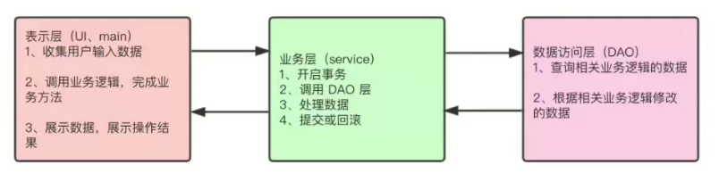

# Spring全家桶你真的了解吗

​		我们在使用java进行Web应用开发时，我们会经常接触到Spring、Spring MVC、Spring Boot、Spring Cloud这些概念，有的同学对这些概念不太了解或者区分不开，下面是对它们的介绍和一些区别。

我们可以这样理解：

- Spring是一个“引擎”
- Spring MVC是基于Spring的一个MVC框架
- Spring Boot是基于Spring4的条件注册的一套快速开发整合包
- Spring Cloud是基于Spring Boot搭建的分布式微服务系统解决方案

## Spring

​		Spring是核心，其他框架都得在它的基础上运行，它本质是个容器，通过XML配置文件可以配置Bean对象，或者通过注解如：@Compnent，@Configuration+@Bean等注解，告知程序启动时要给那些类创建对象，并放入容器。其中两个最重要的概念是IOC（控制反转）和AOP（面向切片编程）

​		IOC 控制反转，即将创建对象的工作交由程序进行，程序运行起来后框架解析注解后就自动反给你这个对象。举个例子，你写了一个XxxService类，其他地方要使用这个类，现在只需要在XxxService类上添加@Service注解，使用的地方写上@Autowired（或者@Resource）XxxService xxxService就可以使用Service对象了。你可能觉得new 一个对象不是什么复杂的事情，但通过注解从容器中拿到的都是同一个对象，而你每次new的都是不同的对象，显然一个Service类只需要一个对象就够了，这就节省了不必要的内存占用。

​		AOP 面向切片编程，即把一段代码嵌入到需要插入的方法的指定位置，是通过动态代理实现的。提高了代码的复用性，也方便拓展，还把其中最重要的事务切面给你准备好了。例如上面的XxxService，如果我需要在这个类中的方法A中切入一段业务代码，可以在一个切面类中写一个切入点方法，通过注解指明切到XxxService的方法A的某个位置（可以指明符合条件的多个位置），Spring在通过反射代理创建XxxService实例对象后，在初始化时会创建一个代理对象，这个代理对象的方法A就已经切入了业务代码。这样的好处就是，我在写方法A的时候完全不需要考虑业务的代码，并且要切入到哪里，以及业务代码有变动，都完全符合开闭原则。

## Spring MVC

Spring MVC提出了一个前端控制器DispatcherServlet，它会拦截所有请求，根据请求找到对应的处理方法来处理，你写的Controller方法只要标注是处理哪个请求的就行，这样写起来会简便很多，你需要哪些参数，参数列表写个名字就直接解析给你（有些要配合注解）。还提出了Model View Controller三个模块，这样拆开更明确。

## Spring Boot

Spring Boot是框架的框架，在前面之上又封装了一层，作用就是进一步简化开发。提出了约定大于配置，前面使用Spring MVC中你得写大量的配置文件，Spring Boot直接给你一套默认配置，并且你Maven导的哪个包，对应的配置会自动生效，你只需要写你需要改的一小部分配置，就会自动替换掉默认配置。此外还增加了指标监控等功能。

## Spring Cloud

Spring Cloud大部分的功能插件都是基于Spring Boot去实现的，Spring Cloud关注于全局的微服务整合和管理，将多个Spring Boot单体微服务进行整合以及管理；Spring Cloud依赖于Spring Boot开发，而Spring Boot可以独立开发。

## Spring和Spring MVC的区别

Spring是IOC和AOP的容器框架，Spring MVC是基于Spring功能之上添加的Web框架，想用Spring MVC必须先依赖Spring。

## Spring Boot和Spring MVC的区别

Spring MVC提供了一种轻度耦合的方式来开发Web应用。

Spring MVC是Spring的一个模块，是一个Web框架。通过DispatcherServlet，ModelAndView和ViewResolver，开发Web应用变得很容易。解决的问题领域是网站应用程序或者服务开发——URL路由、Session、模板引擎、静态Web资源等

Spring Boot实现了自动配置，降低了项目搭建的复杂度。

众所周知Spring框架需要大量的配置，Spring Boot引入自动配置的概念，让项目设置变得容易。Spring Boot本身并不提供Spring框架的核心特性以及扩展功能，只是用于快速、方便地开发新一代基于Spring框架的应用程序。也就是说它并不是用来代替Spring的解决方案，而是和Spring框架紧密结合用于提升Spring开发者体验的工具。

## 总结

​		Spring是核心，提供了基础功能；Spring MVC是基于Spring的一个MVC框架；Spring Boot是为了简化Spring配置的快速开发整合包；Spring Cloud是构建在Spring Boot之上的服务治理框架。

